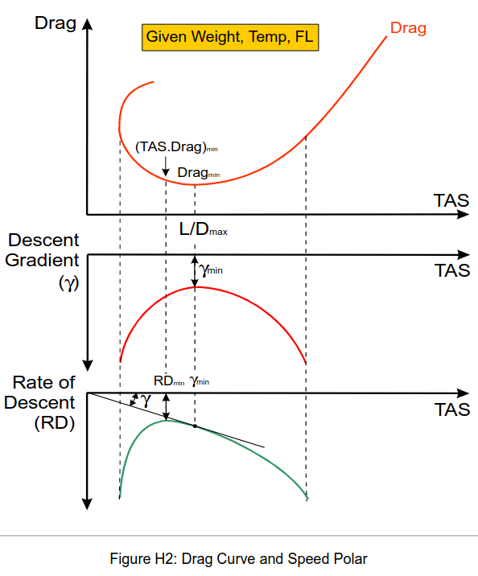
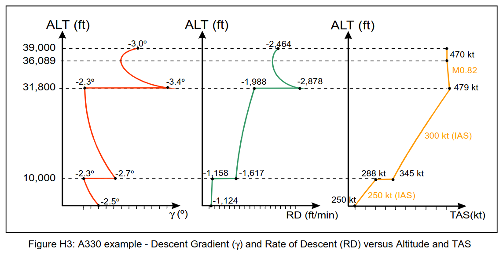

  # Getting to Grips with Aircraft Performance

  # DESCENT/Holding

  γ = Descent gradient

  RD = Rate of Descent (Vertical Speed) : The rate of descent (RD) represents the vertical component of the  aircraft’s speed. It is negative and expressed in feet per minute.

## 1.2 Descent Equations

While climb is due to excess thrust, descent is, on the other hand, caused by a lack of thrust. Therefore, the descent gradient and the rate of descent, which depend on the difference (Thrust – Drag), are negative.


### 1.2.1. Descent Gradient (γ)

```python
At a given weight, the magnitude of the descent gradient is minimum when the drag is minimum, or when the lift-to-drag ratio is maximum. The minimum descent angle speed is, therefore, green dot speed.
```

### 1.2.2. Rate of Descent (RD)

```
Conclusion: At a given aircraft weight, the rate of descent is minimum, when `TASxDrag` is minimum.
```

### 1.2.3. Speed Polar 速度极曲线


The example below (Figure H2) illustrates both thrust and drag forces, as opposed to True Air Speed.  The above equations indicate that, for a given weight:  • The descent angle (γ) is proportional to the drag force, which is at its  minimum at green dot speed.  • The rate of descent (RD) is proportional to the power of the drag force. As RD = TAS.γ, the minimum rate of descent is obtained for a TAS lower than  green dot (when dRD/dTAS = 0).

## 1.3. Influencing Parameters
### 1.3.1. Altitude Effect



FMS（飞行管理系统）并不直接调整飞机的飞行路径角（flight path angle）来控制垂直速度（下降率），而是通过设定垂直速度目标指令发给自动飞行控制系统（AFCS）。AFCS通过调节飞机的俯仰角（pitch angle），间接改变飞机的飞行路径角，从而实现对垂直速度的控制。

具体几点如下：

飞机的垂直速度（也即下降率）和下降梯度是由垂直速度控制系统管理的。FMS计算出所需的垂直速度（基于飞行计划高度、速度目标等），将其作为目标输入给AFCS。

AFCS核心是通过改变俯仰角来调节飞机的纵向运动，俯仰角的改变会引起飞行路径角（flight path angle，即飞机在垂直面内的航迹倾角）的变化，从而改变垂直速度。

飞行路径角的改变不是直接由FMS命令，而是飞控系统通过俯仰角调整来“实现”FMS设定的垂直速度目标。

如果不进行这种垂直速度控制，下降率和下降梯度在飞机处于怠速（idle）且不调俯仰角时确实会持续增大，这不符合飞行计划和安全舒适要求。

总结：
FMS通过设定垂直速度目标来“间接”控制下降率，AFCS通过调整俯仰角来改变飞行路径角，实现这一目标，从而防止下降率和下降梯度持续无序增大。

这一机制解释了为什么切换飞行模式时，下降梯度会出现明显变化，因为FMS调整了目标垂直速度，飞控系统对应调整俯仰姿态和飞行路径角来配合实现控制目标。

风的影响本质：影响的是地面轨迹而非空中性能，这对航路规划至关重要！