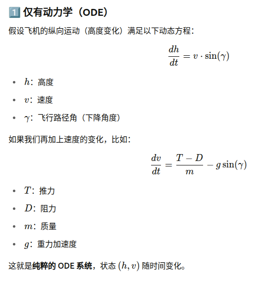
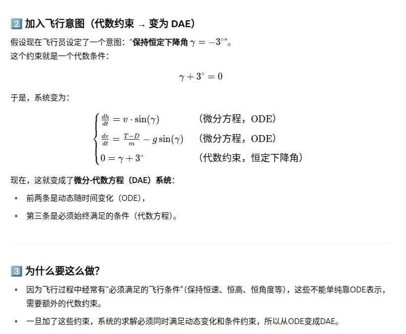

✈️ 机载系统介绍 / On-board Systems Introduction

RAMON - This PhD thesis only focuses on the on-board systems required to satisfy CTAs during CDOs.

🌐标题 / Title:
🌐实现连续下降操作期间满足控制到达时间要求的飞行管理系统
🌐Flight Management System for Satisfying Control Time of Arrival Requirements during Continuous Descent Operations

🌍✈️📉介绍 / Introduction:
现代航空对能满足精确时刻到达要求的飞行路径规划有着严格的需求。在连续下降操作（CDOs）中，实现控制到达时间（CTA）的关键在于采用先进的机载系统，其中飞行管理系统（FMS）扮演着核心角色。

Modern aviation demands precise time-of-arrival compliance for flight path planning. Achieving Control Time of Arrival (CTA) during Continuous Descent Operations (CDOs) relies on advanced onboard systems, with the Flight Management System (FMS) playing a pivotal role.

📌功能 / Functions:

实时轨迹规划 / Real-time Trajectory Planning:

FMS通过不断更新的环境信息（如风速变化），实时调整飞机的路径计划，以确保满足CTA要求。

The FMS dynamically adjusts the aircraft's trajectory plan with continuously updated environmental information (e.g., wind speed changes) to guarantee CTA compliance.

📌能量管理 / Energy Management:

采用智能能量管理策略，实现能量中和下降，以最小化燃油消耗和环境影响。

Employ intelligent energy management strategies to achieve energy-neutral descent, minimizing fuel consumption and environmental impact. `ONLY ELEVATOR`

📌敏感性分析 / Sensitivity Analysis:

进行敏感性分析以快速响应飞行路径的调整需求，优化资源使用和提高响应速度。

Conduct sensitivity analysis to quickly respond to trajectory adjustment demands, optimizing resource use and improving response speed.

📌综合优化 / Comprehensive Optimization:

整合多种指导策略，包括战术、战略和非线性模型预测控制（NMPC），以实现最佳飞行路径。

Integrate multiple guidance strategies, including tactical, strategic, and Nonlinear Model Predictive Control (NMPC), to achieve optimal flight path.

📌数据联网 / Data Networking:

通过网络共享风观测数据，实现更稳定和精确的路径规划。

Achieve more stable and precise trajectory planning by networking wind observation data.

🎯  总结 / Summary:
这套机载系统以其高效的实时规划、动态能量管理和多策略优化，为满足复杂空域中精确的到达时间要求提供了有力保障。这不仅提升了航班效率，也推动了航空运营的环保和经济效益。

This onboard system, with its efficient real-time planning, dynamic energy management, and multi-strategy optimization, robustly ensures precise time-of-arrival compliance in complex airspace. It not only enhances flight efficiency but also drives aviation operation's environmental and economic benefits.

🌍✈️📉系统的基本功能和作用！📘


```
Chapter V proposes two variants of the generic NMPC guidance strategy that rapidly update the optimal trajectory plan by using parametric sensitivities of the active trajectory plan. Then, the performance of these two variants are compared with those of an ideal NMPC, which updates the optimal trajectory plan instantaneously at each re-calculation instant, as well as those of the open-loop execution of the initial trajectory plan computed before the TOD.

```
在这个博士论文的研究范围内，水平路径不改变，主要关注的是优化控制到达时间（CTA）和下降的垂直剖面。

📌 具体内容说明：
CTA调整：

时间管理：核心是确保飞机在预计的时间到达指定点，时间调整可能涉及速度的调节以适应CTA。

下降剖面的优化：

垂直飞行剖面：调整飞行高度和速度以优化能量使用，并满足环境要求（例如减少燃油消耗和噪声）。

能量管理：利用升降舵和推力调整仅在垂直剖面上进行优化，而不是更改水平路径。

总结：
研究的重点是确保在既定的水平路径上，通过精细调整垂直飞行剖面和时间管理策略，以增强飞行的效率和符合CTA，而不改变整体飞行路线。若需要更多信息，请随时提出，我会乐意提供更深入的解释和支持！📈✈️


# 2. Framework on trajectory management
### 
Since this PhD thesis assumes an operational concept in which the lateral route is fixed and only the vertical profile is managed to satisfy controlled time of arrivals (CTAs), the concept of trajectory plan will refer `only` to the vertical profile.

In current FMSs, the trajectory plan is constructed by `numerical integration of the differential equations` of the mathematical model describing the dynamics of the aircraft.

未来的飞行管理系统（FMS）将能够更优地规划和执行连续下降操作（CDOs），同时满足控制到达时间（CTAs）的要求。这些系统需要具备以下能力：

实时轨迹规划算法：需要能够快速生成实时最优轨迹计划，以符合输入的要求到达时间（RTAs）和典型的运行约束。这意味着系统可以动态调整并优化飞机的下降路径，以实现高效和精确的时间管理。

满足RTAs的指导系统：需具备引导系统，以确保飞机能在遵守环保要求的同时满足RTAs。这要求系统在规划过程中即使出现模型误差，也能找到最节能的飞行路径。

通俗的说，就是未来的飞机导航系统将能够动态调整飞行路径，以确保准时抵达，同时尽量减少对环境的影响，即减少噪音和排放。即使在计算上有一些小误差，系统仍力求找到最节能且环保的飞行方案。

### 数值法  VS 解析法
`Analytical methods`: These involve solving problems using exact formulas or symbolic manipulations, such as solving quadratic equations, calculating integrals, and performing rational number operations. They provide exact solutions through mathematical derivations and symbolic computations, like:

Formula-based solutions: Using formulas such as the quadratic formula or integral expressions to obtain precise values.

Algebraic manipulations: Employing algebraic rules for symbolic calculations.

Calculus formulas: Using calculus-based derivations to solve differential equations or integration problems.

In high school, these are the traditional, rigorous approaches that are taught.

`Numerical methods`: These methods provide approximate solutions and are used when analytical solutions are difficult or impossible to obtain due to complexity (like nonlinear equations or equations that can't be easily expressed using simple formulas). Numerical methods are particularly suited for computation, utilizing iterative and approximation techniques to achieve desired accuracy. They are efficient for handling real-world complex problems often modeled computationally.

Each approach has its strengths: analytical methods offer exact solutions, while numerical methods are more practical for complex, real-world applications where precision might be sacrificed for efficiency and solvability.

## 2.1 Models needed for trajectory management

✅ 通俗解释：
ODE 像是“自由演化”：你推一辆车下坡，只要知道初始速度和坡度，它自己会滚下去。

DAE 像是“受约束的演化”：现在加了一个刹车规定“车速必须保持60km/h”，于是每次车速一变，你必须用刹车或油门去强制调整，保持这个代数条件成立。

因为多了这个“强制条件”，就不再是纯粹的 ODE 了，必须变成“微分 + 代数”的混合系统（DAE）。

