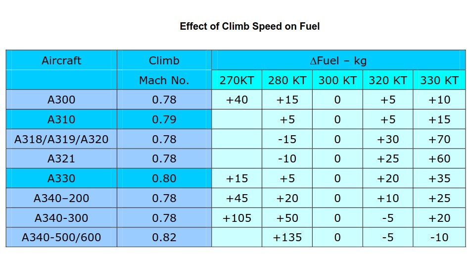
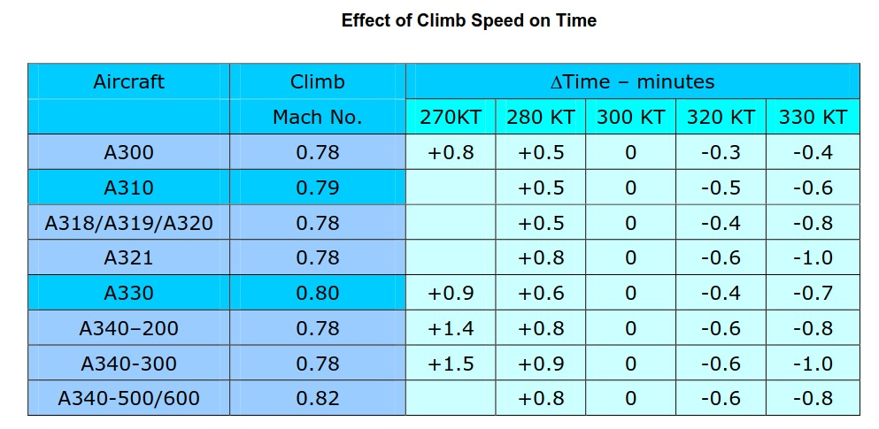
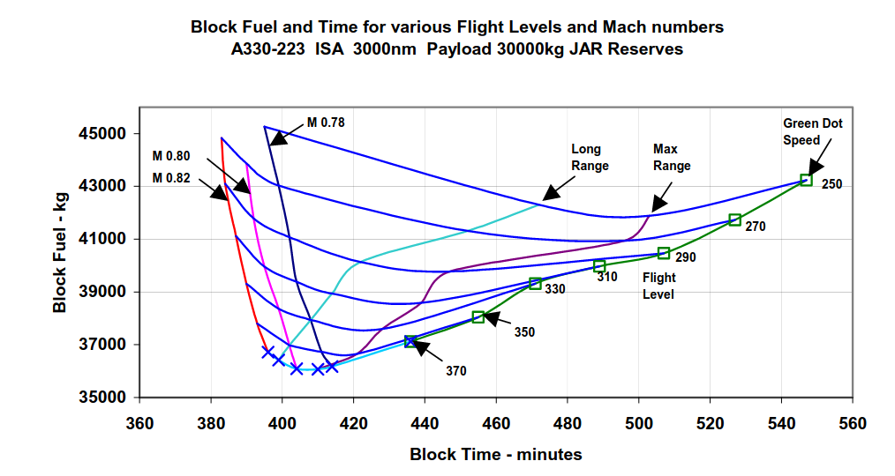

The correct selection of the cruise parameters is therefore fundamental in minimizing fuel or operating cost. This chart shows the normal laws that aircraft consume less fuel when flown slower or when flown higher. However there are limits to these laws. Flying lower than the maximum range speed will increase the block fuel, as will flying higher than an optimum altitude.

你的这段话总结了飞机在选择巡航速度和高度时，关于燃油消耗（或运营成本）的基本规律和实际限制：

慢飞、省油、高飞、更省油
一般而言，飞机飞得慢一点（低于最大效率/最大航程速度）和飞得高一些（靠近最优巡航高度），确实会降低燃油消耗。这是因为高空气密度更低、阻力更小，慢飞时发动机效率也较好。

规律的极限与现实限制
但这种“越慢（越高）越省油”的规律并不是无限制成立的。

如果巡航速度比“最大航程速度”（即燃油最经济速度）还低，发动机效率反而下降，而且飞机在空中停留时间更久，耗油量（`block fuel`，即整个航段油耗）反而会上升。

同样，飞得高于最优高度时，发动机推力和气动效率都会变差，燃油消耗也会增加。

最佳经济性点
所以，飞机在每个阶段都有一个“最经济速度”和“最优高度”，即：

最大航程速度/`Max Range Speed`：再慢下去会适得其反，让总油耗变多。

最优高度/`Optimum Altitude`：再高则空气太薄，推力/升力比变差，也会导致油耗增加。

总结：

总体规律是“慢飞高飞省油”，但不能一味追求极限。

超过最优点（无论更慢还是更高），都会让总燃油消耗（和成本）增加。

飞行管理系统和飞行员都需不断综合权衡，以实际飞行条件找到“最佳速度和高度”，实现真正的燃油经济性和成本优化。

你发的这张图表（Block Fuel and Time for various Flight Levels and Mach numbers）展示了A330-223飞机，在飞行3000海里、载重30吨、不同飞行高度和马赫数组合下，全程总油耗（Block Fuel）与全程总用时（Block Time）的关系。

下面是详细解读：

1. 坐标轴与含义
横轴（Block Time – minutes）：表示从撤挡到挡轮挡的全程时间（单位：分钟）。

纵轴（Block Fuel – kg）：全程飞行过程的总油耗（单位：公斤）。

2. 曲线代表什么
不同颜色的曲线表示不同的飞行高度（FL 250, 270, 290, 310, 330, 350），从低到高，绿色-蓝色-紫色-红色递增。

相同曲线上的各点代表在不同马赫数/速度下的油耗-时间组合。比如曲线左端是高马赫（M0.80、M0.82），油耗高、时间短，右端是低速（Green Dot Speed），油耗高、时间长。

3. “X”和“□”符号
“X”表示最大巡航马赫数时的数据点（左侧油耗高，时间短）。

“□”表示不同飞行高度下的低速（Green Dot Speed）点（右侧，油耗高，时间长）。

4. 最优点与平衡
每条高度曲线最弯曲的“谷底”就是最低油耗点（Max Range），接近于“长航程速度”点（Long Range）。

在左侧，飞得越快（高马赫），时间短但油耗增加。

在右侧，飞得越慢（Green Dot Speed），由于效率变低，总油耗也会明显增加，且飞行时间变很长。

真正燃油最省的位置（Max Range/Long Range）通常在速度和时间的平衡点：既不是最慢，也不是最快。

5. 不同高度对油耗和时间的影响
高度越高（如FL350），曲线“谷底”越低（更省油），但要求飞机重量和性能允许。

飞行高度低（如FL250），整体油耗曲线抬高，无论快慢都比高空更多耗油。

6. 运营决策含义
想节省油耗，应选择最优高度（通常越高越好，但要结合重量和气象条件）和Max Range附近马赫数飞行。

若时间优先，可以适当提高马赫（比如M0.80或M0.82），但油耗明显上升。

反之，一味慢飞或太低高度，既耗时又不省油。

曲线清楚显示了“快省时间、慢省油”的权衡区间。

总结一句话
每个飞行高度和速度都有对应的“油耗-时间”最佳点，既不能一味追求高速度（费油），也不能只看低速度（超慢且反而费油），要综合权衡速度、高度和经济性，才能实现最优飞行。

