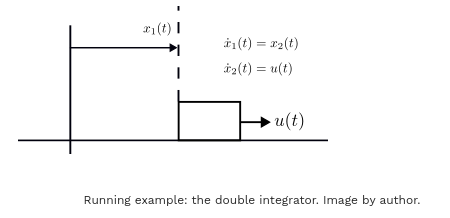

https://towardsdatascience.com/model-predictive-control-basics/

https://github.com/willem-daniel-esterhuizen/MPC_tutorial

# Model Predictive Control Basics
## A hands-on tutorial with Python and CasADi
Willem Esterhuizen

## Quick Summary
In this article we will:

Cover the basic ideas.
Code up a solver in Python.
Play with a simple linear system: the double integrator.
Get all the code here: https://github.com/willem-daniel-esterhuizen/MPC_tutorial

## 1. Introduction
Model predictive control (MPC) is a popular feedback control methodology where a finite-horizon optimal control problem (OCP) is iteratively solved with an updated measured state on each iteration.


In the OCP one uses a model of the plant to find the optimal open loop control over the finite horizon considered. Because the model cannot capture the true plant’s behaviour 100%, and because in the real world the system is subjected to noise and disturbances, one only applies the first portion of the optimal open loop control, and regularly measures the state to re-solve the OCP. This closes the loop and creates a feedback.

The maths behind it is relatively simple and intuitive (especially when compared to things like robust control) and it is easy to code up an MPC controller. Other pros are that it can effectively handle hard and soft constraints on the state and control (hard constraints are strict, whereas soft constraints are enforced via penalisation in the cost function) and it can generally be used on nonlinear systems with nonconvex constraints (depending on how nasty these are of course!). The only con is that you need to solve a optimization problems “online” in real time, which can be a problem if you’re controlling a fast system or have limited computing resources.

### 1.2 Running Example
Throughout the article I will consider the double integrator with a zero-order hold control (i.e. a piecewise constant control) as the running example in the code. The continuous time system reads:
\[
\begin{align*}
\dot{x}_1(t) &= x_2(t), \\
\dot{x}_2(t) &= u(t),
\end{align*}
\]
With \( t \in \mathbb{R} \) denoting time. Here \( x_1(t) \in \mathbb{R} \) is the position whereas \( x_2(t) \in \mathbb{R} \) is the velocity. You can think of this system as a 1kg block sliding on a frictionless table, with \( u(t) \) the applied force.



If we constrain the control to be piecewise constant over intervals of length 0.1 seconds, we get the discrete-time system:

\[ x_{k+1} = Ax_k + Bu_k, \]

with \( k \in \mathbb{Z} \), where,

\[ 
A := \begin{pmatrix} 
1 & 0.1 \\ 
0 & 1 
\end{pmatrix}, \quad 
B := \begin{pmatrix} 
0.05 \\ 
1 
\end{pmatrix} 
\]

and \( x_k \in \mathbb{R}^2 \), \( u_k \in \mathbb{R} \).

(Note that I use \( x_k \) and \( u_k \) to refer to the discrete-time system’s state and control to make the notation neater in the rest of the article.)

## A矩阵：

\[ 
A = \begin{pmatrix} 
1 & 0.1 \\ 
0 & 1 
\end{pmatrix} 
\]

- 第1行：位置的状态转移方程
- 第2行：速度的状态转移方程

## B矩阵：

\[ 
B = \begin{pmatrix} 
0.005 \\ 
0.1 
\end{pmatrix} 
\]

- 第1行：控制输入对位置的影响
- 第2行：控制输入对速度的影响

## 完整的离散系统方程：

[x₁(k+1)]   [1   0.1] [x₁(k)]   [0.005]
[x₂(k+1)] = [0   1  ] [x₂(k)] + [0.1  ] u(k)

## 展开就是：

- 位置方程：\( x₁(k+1) = x₁(k) + 0.1 \cdot x₂(k) + 0.005 \cdot u(k) \)
- 速度方程：\( x₂(k+1) = x₂(k) + 0.1 \cdot u(k) \)


You can use the scipy packages’s cont2discrete function to get this discrete time system, as follows:

```python
import numpy as np
from scipy.signal import cont2discrete

A = np.array([[0, 1],[0, 0]])
B = np.array([[0],[1]])
C = np.array([[1, 0],[0, 1]])
D = np.array([[0, 0],[0, 0]])
dt = 0.1 # in seconds
discrete_system = cont2discrete((A, B, C, D), dt, method='zoh')
A_discrete, B_discrete, *_ = discrete_system

```
scipy的cont2discrete函数优势

自动化计算 - 不需要手工推导矩阵指数和积分
数值稳定 - 使用高精度算法
支持多种方法 - zoh（零阶保持）、foh（一阶保持）等
避免计算错误 - 特别是对于高维复杂系统

所以当你面对新的系统时，只需要：

建立连续时间模型（A, B, C, D矩阵）
选择采样时间（dt）
调用scipy函数自动离散化

原始微分方程：
ẋ₁(t) = x₂(t)
ẋ₂(t) = u(t)
写成矩阵形式：
[ẋ₁(t)]   [0 1] [x₁(t)]   [0]
[ẋ₂(t)] = [0 0] [x₂(t)] + [1] u(t)
所以：A = [[0,1],[0,0]], B = [[0],[1]]
输出方程：
假设我们想观测位置和速度：
[y₁(t)]   [1 0] [x₁(t)]   [0]
[y₂(t)] = [0 1] [x₂(t)] + [0] u(t)
所以：C = [[1,0],[0,1]]（单位矩阵），D = [[0],[0]]（通常为零）
总结
ABCD矩阵就是从原始的物理微分方程直接写出来的！
物理方程 → 状态空间形式 → A,B,C,D矩阵

## 2. Optimal Control Problem

1. 运行成本（Running Cost）
状态成本：x_k^T Q x_k
x_k^T Q x_k = [x₁ₖ x₂ₖ] [q₁₁ q₁₂] [x₁ₖ]
                          [q₁₂ q₂₂] [x₂ₖ]
              = q₁₁x₁ₖ² + 2q₁₂x₁ₖx₂ₖ + q₂₂x₂ₖ²
物理含义：

q₁₁：位置偏差的惩罚权重
q₂₂：速度偏差的惩罚权重
q₁₂：位置-速度交叉项（通常为0）

控制成本：u_k^T R u_k = R·u_k²
物理含义：

惩罚控制力的使用
R越大 → 越"节能"，控制越温和
R越小 → 控制越"激进"

2. 终端成本（Terminal Cost）
x_K^T Q_K x_K
物理含义：

确保最终状态接近期望值
通常 Q_K >> Q（终端惩罚更重）
保证系统最终"停在正确位置"

3. 设计权衡
典型权重选择：
pythonQ = [[10,  0 ],    # 位置很重要
     [0,   1 ]]    # 速度较次要

R = 0.1            # 控制成本较小

Q_K = [[100, 0 ],  # 终端位置非常重要  
       [0,   10]]  # 终端速度也重要
权重影响：

大Q → 状态跟踪精确，但可能控制激烈
大R → 控制平滑，但跟踪可能较差
大Q_K → 终端精度高，但过程可能不平稳

4. 物理直觉
这个代价函数在说：

"我希望系统状态尽量小（接近原点），控制力尽量小，最终状态特别要小"

这就是典型的调节器问题：把系统稳定到原点！
We’ll consider the following discrete-time optimal control problem (OCP):
## Optimal Control Problem

We consider the following Optimal Control Problem (OCP):

\[
\begin{aligned}
& \min_{u, x} && \sum_{k=0}^{K-1} \left( x_k^\top Q x_k + u_k^\top R u_k \right) + x_K^\top Q_K x_K \\
& \text{subject to:} \\
& && x_{k+1} = A x_k + B u_k, \quad x_0 = \bar{x}, \\
& && x_k \in [-1, 1] \times (-\infty, \infty), \\
& && u_k \in [-1, 1], \\
& && k \in [0:K-1], \\
& && k \in [1:K], \\
& && k \in [0:K-1], \dots
\end{aligned}
\]

### Where:

- \( K \in \mathbb{R}_{\geq 0} \) denotes the finite horizon over which we solve the OCP.
- \( k \in \mathbb{Z} \) denotes the discrete time step.
- \([p:q]\), with \( p, q \in \mathbb{Z} \), denotes the set of integers \(\{ p, p+1, \ldots, q \}\).
- \(\bar{x} \in \mathbb{R}^2\) denotes the initial condition of the dynamical system.
- \(x_k \in \mathbb{R}^2\) denotes the state at step \(k\).
- \(u_k \in \mathbb{R}\) denotes the control at step \(k\).
- \( Q \in \mathbb{R}^{2 \times 2}, R \in \mathbb{R}, \text{ and } Q_K \in \mathbb{R}^{2 \times 2} \) are square positive definite matrices that specify the cost function (R is scalar here because \( u \) is scalar).

### Additional Notations:

- \( u = (u_0, u_1, \ldots, u_{K-1}) \in \mathbb{R}^K \) denotes the control sequence.
- \( x = (x_0, x_1, \ldots, x_K) \in \mathbb{R}^{2(K+1)} \) denotes the state sequence.

## Optimal Control Problem (OCP)

To be rigorous, we’ll say that the pair \((u^*, x^*) \in \mathbb{R}^K \times \mathbb{R}^{2(K+1)}\) is a solution to \(\text{OCP}(\bar{x})\) provided that it minimizes the cost function over all admissible pairs, that is,

\[
J(u^*, x^*) \leq J(u, x), \quad \forall (u, x) \in \Omega
\]

where \(J: \mathbb{R}^K \times \mathbb{R}^{2(K+1)} \to \mathbb{R}_{\geq 0}\) is defined as,

\[
J(u, x) = \left( \sum_{k=0}^{K-1} x_k^\top Q x_k + u_k^\top R u_k \right) + x_K^\top Q_K x_K
\]

and \(\Omega\) denotes all admissible pairs:

\[
\Omega = \{ (u, x) \in \mathbb{R}^K \times \mathbb{R}^{2(K+1)} : \text{conditions (1)−(4) hold} \}.
\]

Thus, the optimal control problem is to find a control and state sequence, \((u^*, x^*)\), that minimizes the cost function, subject to the dynamics, \(f\), as well as constraints on the state and control: \(x_k \in [-1, 1] \times (-\infty, \infty)\), \(u_k \in [-1, 1]\), for all \(k\). The cost function is vital to the controller’s performance. Not only in the sense of ensuring the controller behaves well (for example, to prevent erratic signals) but also in specifying the equilibrium point the closed loop state will settle at. More on this in Section 4.

Note how \(\text{OCP}(\bar{x})\) is parameterized with respect to the initial state, \(\bar{x}\). This comes from the fundamental idea behind Model Predictive Control (MPC): that the optimal control problem is iteratively solved with an updated measured state.

这段话的核心信息：

严格定义了什么叫"解决"最优控制问题：

找到一对控制和状态序列 (u*, x*)
这对序列必须满足所有约束条件
在所有满足约束的序列中，它的成本最小
这就是我们要的"最优解"


简单总结：在所有"可以做的"方案中，找到"最好的"那一个！
u_k^T R u_k 项的作用：
- R 很大 → 惩罚大的控制输入 → 平滑控制
- R 很小 → 允许大的控制输入 → 可能剧烈变化
实际例子：

汽车控制：防止方向盘急转、急加速急刹车
机器人：防止关节运动过于剧烈
化工过程：防止阀门频繁开关

## 2.1 Coding an OCP solver
CasADi’s opti stack makes it really easy to set up and solve the OCP.

First, some preliminaries:
```python
from casadi import *

n = 2 # state dimension
m = 1 # control dimension
K = 100 # prediction horizon

# an arbitrary initial state
x_bar = np.array([[0.5],[0.5]]) # 2 x 1 vector

# Linear cost matrices (we'll just use identities)
Q = np.array([[1. , 0],
            [0. , 1. ]])
R = np.array([[1]])
Q_K = Q

# Constraints for all k
u_max = 1
x_1_max = 1
x_1_min = -1

```

Now we define the problem’s decision variables:
```python
opti = Opti()

x_tot = opti.variable(n, K+1)  # State trajectory
u_tot = opti.variable(m, K)    # Control trajectory
```
opti：优化问题的容器
x_tot：包含整个预测时域的状态序列
u_tot：包含整个预测时域的控制序列
维度匹配：状态比控制多一个时间点（因为包含终端状态）
m=2, n=1  维度

Next, we impose the dynamic constraints and set up the cost function:
```python
# Specify the initial condition
opti.subject_to(x_tot[:, 0] == x_bar)

cost = 0
for k in range(K):
    # add dynamic constraints
    x_tot_next = get_x_next_linear(x_tot[:, k], u_tot[:, k])
    opti.subject_to(x_tot[:, k+1] == x_tot_next)

    # add to the cost
    cost += mtimes([x_tot[:,k].T, Q, x_tot[:,k]]) + \     
                           mtimes([u_tot[:,k].T, R, u_tot[:,k]])

# terminal cost
cost += mtimes([x_tot[:,K].T, Q_K, x_tot[:,K]])

```


```python
def get_x_next_linear(x, u):
    # Linear system
    A = np.array([[1. , 0.1],
                [0. , 1. ]])
    B = np.array([[0.005],
                  [0.1  ]])
    
    return mtimes(A, x) + mtimes(B, u)

```

x_tot[:,k]     # 第k时刻的状态向量 x_k (2×1)
x_tot[:,k].T   # 转置后的行向量 x_k^T (1×2)  
Q              # 权重矩阵 (2×2)
x_tot[:,k]     # 再次使用状态向量 x_k (2×1)

mtimes([x_tot[:,k].T, Q, x_tot[:,k]])
#       ↑            ↑   ↑
#      (1×2)       (2×2) (2×1)
#         ↘       ↙      ↓
#         (1×2)          ↓
#           ↘           ↙
#            (1×1) = 标量


系统动力学 vs 成本函数 是两回事！
线性的部分：系统动力学
pythondef get_x_next_linear(x, u):
    # 这里是"线性"的！
    return A @ x + B @ u  # x_{k+1} = Ax_k + Bu_k
这是线性的：

状态转移方程是线性的
没有 x2x^2
x2、sin⁡(x)\sin(x)
sin(x) 等非线性项


二次的部分：成本函数
python# 这里是"二次"的！
cost += mtimes([x_tot[:,k].T, Q, x_tot[:,k]])  # x_k^T Q x_k
这是二次型：

成本函数包含状态的平方项
目的是惩罚偏离原点的程度

两者的区别和联系
1. 动力学约束（线性）
python# 描述系统如何演化
x_{k+1} = Ax_k + Bu_k  # 线性关系
物理含义：

告诉我们"给定当前状态和控制，下一状态是什么"
这是物理定律，必须满足

2. 成本函数（二次）
python# 描述我们的偏好
J = Σ(x_k^T Q x_k + u_k^T R u_k)  # 二次型
设计含义：

告诉我们"什么样的状态和控制是好的"
这是人为设计的，可以选择

为什么会这样设计？
动力学选择线性的原因
python# 1. 物理系统本身可能是线性的（如质点运动）
# 2. 非线性系统的线性化近似
# 3. 计算简单，适合实时控制
成本选择二次的原因
python# 1. 数学性质好（凸函数）
# 2. 大偏差惩罚重，小偏差容忍
# 3. 有解析解（LQR）
# 4. 计算高效（二次规划）
完整的MPC问题结构
pythonminimize    Σ(x_k^T Q x_k + u_k^T R u_k)    # ← 二次目标函数
subject to  x_{k+1} = Ax_k + Bu_k            # ← 线性动力学约束
            u_k ∈ [-1, 1]                    # ← 线性不等式约束
            x_k ∈ feasible_set               # ← 线性不等式约束
问题类型：线性约束的二次规划（Linear-Quadratic Programming）
类比理解
类比：开车导航
动力学（线性）：
"车辆如何运动"
速度[k+1] = 速度[k] + 加速度[k] * 时间
位置[k+1] = 位置[k] + 速度[k] * 时间

这是物理定律，不能违反！
成本函数（二次）：
"什么样的驾驶是好的"
成本 = (偏离车道距离)² + (超速程度)² + (急加速程度)²

这是偏好设计，可以调整！
数学上的兼容性
为什么可以结合？
python# 线性约束 + 二次目标 = 凸优化问题
# 这是优化理论中的经典组合！

minimize    f(x) = x^T Q x        # 凸目标函数（二次）
subject to  g(x) = Ax - b = 0     # 线性约束
            h(x) = Cx - d ≤ 0     # 线性约束
结果：

有全局最优解
可以用高效算法求解（如内点法、活跃集法）

其他常见组合
1. 线性动力学 + 线性成本
pythonminimize    Σ(|x_k| + |u_k|)           # 线性目标
subject to  x_{k+1} = Ax_k + Bu_k      # 线性约束
问题类型：线性规划（LP）
2. 线性动力学 + 二次成本（我们的情况）
pythonminimize    Σ(x_k^T Q x_k + u_k^T R u_k)  # 二次目标
subject to  x_{k+1} = Ax_k + Bu_k          # 线性约束
问题类型：二次规划（QP）
3. 非线性动力学 + 二次成本
pythonminimize    Σ(x_k^T Q x_k + u_k^T R u_k)     # 二次目标
subject to  x_{k+1} = f(x_k, u_k)            # 非线性约束
问题类型：非线性规划（NLP）
实际代码中的体现
线性部分
python# 动力学约束（线性）
for k in range(K):
    x_tot_next = A @ x_tot[:, k] + B @ u_tot[:, k]  # 线性！
    opti.subject_to(x_tot[:, k+1] == x_tot_next)
二次部分
python# 成本函数（二次）
for k in range(K):
    cost += x_tot[:,k].T @ Q @ x_tot[:,k]  # 二次！
    cost += u_tot[:,k].T @ R @ u_tot[:,k]  # 二次！
为什么不用线性成本？
线性成本的问题
python# 假设用线性成本
cost = Σ(|x_k| + |u_k|)
缺点：

不可微：在原点处梯度不存在
解可能不唯一：可能有多个最优解
控制不平滑：容易产生突变

二次成本的优势
python# 使用二次成本
cost = Σ(x_k^T Q x_k + u_k^T R u_k)
优点：

处处可微：梯度处处存在
解唯一：有唯一的全局最优解
控制平滑：鼓励平滑变化

总结
关键理解：

"线性系统" 指的是动力学方程是线性的
"二次成本" 指的是目标函数是二次的
两者可以完美结合：线性约束 + 二次目标 = 凸优化问题

比喻：

就像物理定律（动力学）是线性的，但评价标准（成本）是二次的。比如牛顿第二定律 F=maF = ma
F=ma 是线性的，但能量 E=12mv2E = \frac{1}{2}mv^2
E=21​mv2 是二次的！


这种组合的美妙之处：既保持了计算的高效性（线性约束），又实现了控制的优良性质（二次成本）！

We now add the control and state constraints,
```python
# constrain the control
opti.subject_to(opti.bounded(-u_max, u_tot, u_max))

# constrain the position only
opti.subject_to(opti.bounded(x_1_min, x_tot[0,:], x_1_max))

```
and solve:
```python
# Say we want to minimise the cost and specify the solver (ipopt)
opts = {"ipopt.print_level": 0, "print_time": 0}
opti.minimize(cost)
opti.solver("ipopt", opts)
    
solution = opti.solve()

# Get solution
x_opt = solution.value(x_tot)
u_opt = solution.value(u_tot)

```

We can plot the solution with the repo’s plot_solution() function.

```python
from MPC_tutorial import plot_solution

plot_solution(x_opt, u_opt.reshape(1,-1)) # must reshape u_opt to (1,K)

```


---

### 现实 vs 理想的对比
理想情况（上面的例子）

```python
# 假设完美传感器，无噪声
x_bar = 模型计算的精确值  # 完美预测
```

现实情况（停车例子）
```python
# 有噪声的观测
GPS读数 = 真实位置 + GPS误差  # ±0.3m误差
速度读数 = 真实速度 + 仪表误差  # ±0.05m/s误差

# 观测值成为下一步MPC的起点
x_bar = [GPS读数, 速度读数]  # 带噪声的初始条件
```


### 🚗🎯 实际运行示例
```python
=== 时间步 0 ===
传感器观测: 位置=49.73m, 速度=10.12m/s (有噪声)
MPC初始状态: 位置=49.73m, 速度=10.12m/s (基于观测)
最优控制: -2500N (刹车)
真实状态演化: 位置=50.85m, 速度=8.33m/s

=== 时间步 1 ===  
传感器观测: 位置=50.91m, 速度=8.27m/s (重新观测!)
MPC初始状态: 位置=50.91m, 速度=8.27m/s (基于新观测)
最优控制: -2200N (继续刹车)
真实状态演化: 位置=51.68m, 速度=6.87m/s
```
##### 关键理解：

`每步`的观测值：成为该步MPC优化的起始状态`x_bar`
时间匹配：观测值的时间戳必须与MPC循环`同步`
噪声处理：观测值的质量直接影响MPC性能
闭环反馈：正是因为有观测反馈，MPC能纠正预测误差

#### 就是MPC中观测值驱动控制循环的完整过程！🚗🎯

---

### 三种设计方案对比
##### 方案1：状态 = 观测（理想情况）
```
# 汽车系统：
状态: x = [位置, 速度]           # 2个状态
观测: z = [GPS位置, 速度表读数]   # 2个观测
输出方程: C = [[1,0], [0,1]]    # 完全观测

# 结果：
✅ 控制精度最高
✅ 无需状态估计
❌ 成本最高（需要速度传感器）
```

#### 方案2： 状态 > 观测（常见情况）
```
# 汽车系统：
状态: x = [位置, 速度]     # 2个状态  
观测: z = [GPS位置]       # 1个观测
输出方程: C = [[1,0]]     # 部分观测

# 结果：
⚠️ 需要状态估计（卡尔曼滤波）
⚠️ 控制精度中等
✅ 成本较低（省掉速度传感器）

```

####  方案3：状态 < 观测（过度设计）
```
# 汽车系统：
状态: x = [位置]                    # 1个状态
观测: z = [GPS位置, 激光位置, 视觉位置] # 3个观测
输出方程: C = [[1], [1], [1]]       # 冗余观测

# 结果：
✅ 观测冗余，可靠性高
⚠️ 控制能力有限（只能控制位置，不能直接控制速度）
❌ 成本很高，性价比低

```


---
###  🎯 `输出`定义'控制什么'，`状态`定义'如何演化'
MPC中输出的总结：
1. 定义

输出 y = C·x + D·u
是状态变量的线性组合，不一定是状态本身

2. 主要作用

约束定义：实际的物理约束通常加在输出上
目标函数：优化目标是让输出跟踪参考轨迹
物理意义：代表我们真正关心要控制的物理量

3. 与状态递推的关系
✅ 参与约束定义（输出约束）
✅ 参与目标函数（输出跟踪）
❌ 不参与状态的递推更新
❌ 不影响下一时刻的状态计算
✅ 状态演化只依赖：x(k+1) = A·x(k) + B·u(k)

1. 在MPC滚动中的位置
```
观测x(k) → 优化(考虑输出约束y和目标) → 控制u(k) → 观测x(k+1)
         ↑                                    ↑
    真正的初始条件                        状态更新的驱动
```
1. 本质
输出是状态空间到"关心空间"的映射，让MPC能够直接控制有物理意义的量，而不是抽象的状态变量。
核心：输出定义"控制什么"，状态定义"如何演化"

MPC滚动过程：

```
t时刻: 观测x(t) → 优化(考虑输出约束和目标) → 得到u(t)
t+1时刻: 观测x(t+1) → 直接作为新初始状态 → 下轮优化
```

所以输出更像是一个"窗口"，让我们能够：

定义有物理意义的约束
设置有实际意义的控制目标

但在系统的动态演化中，真正的"驱动力"是状态方程，输出只是状态的一个线性变换表示.

---

#### 输出定义'控制什么'，状态定义'如何演化'，控制定义'通过什么手段演化'

完整的因果链：
```python

控制输入u → 驱动状态演化x → 产生期望输出y
   ↑              ↑              ↑
 我们的手段    系统的动力学    我们的目标

# 数学表达：
u(k) → x(k+1) = Ax(k) + Bu(k) → y(k+1) = Cx(k+1)
```

三者关系总结：
```python
控制u: "用什么手段"     # 我们能施加的作用力/信号/命令
状态x: "怎么变化"       # 系统内部的演化规律  
输出y: "控制什么"       # 我们真正关心的物理量

# MPC的智慧：
# 在输出空间定义目标 → 在状态空间预测演化 → 在控制空间寻找最优手段
```

实际例子验证：

```python
# 汽车停车：
控制u = [油门/刹车力]           # 通过什么手段
状态x = [位置, 速度]           # 如何演化  
输出y = [距离目标的位置]        # 控制什么

# 因果链：
刹车力u → 改变[位置,速度]演化 → 最终控制距离目标的位置y
```

